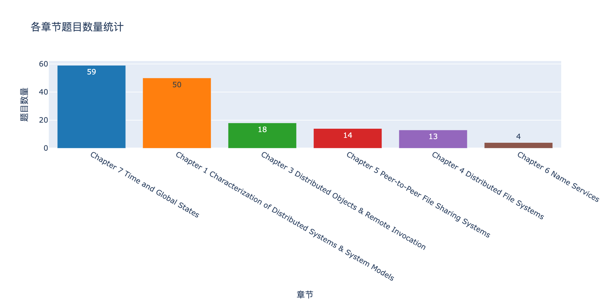
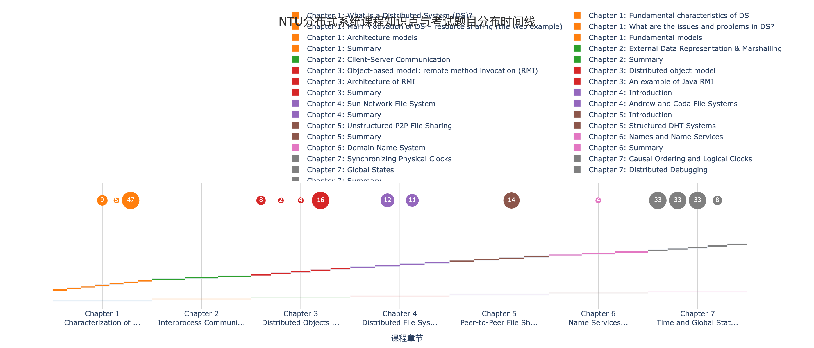
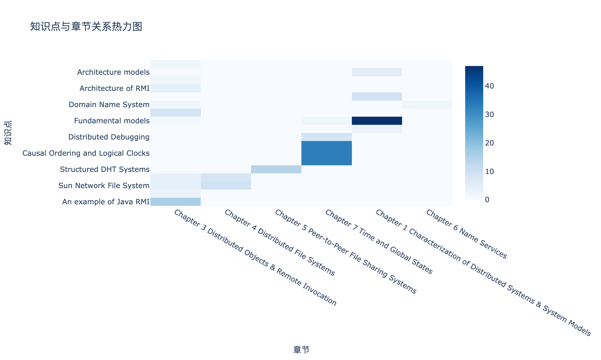
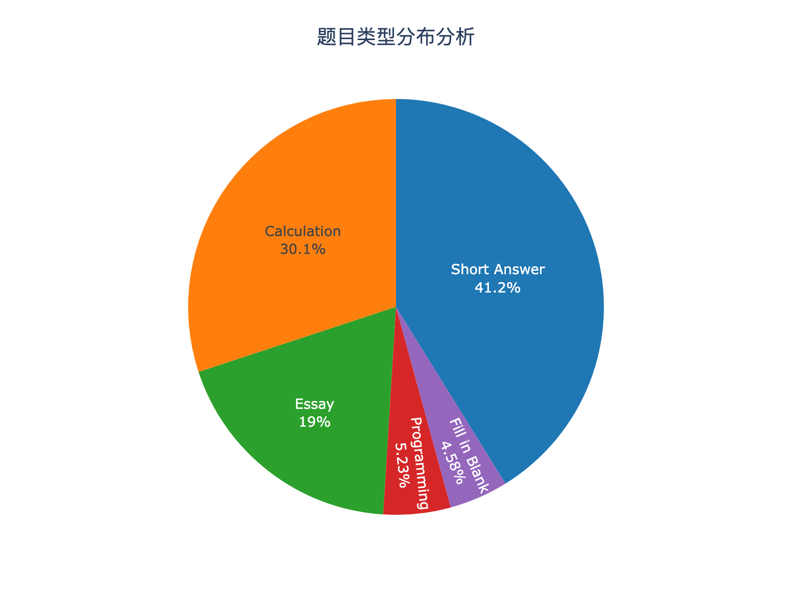

# 分布式系统考试指南项目

### 🌐 在线演示

> 🚀 **GitHub Pages**: [查看在线数据可视化](https://shrimptop.github.io/DistributedSystem_riviewer/)

点击上方链接即可直接在浏览器中体验完整的交互式数据可视化界面，无需本地部署！

## 📊 数据可视化展示可视化预览

### 章节重要性分析


### 课程时间线


### 知识点热力图


### 题型分布饼图


## 🌐 在线演示

> � **GitHub Pages**: [查看在线数据可视化](https://shrimptop.github.io/DistributedSystem_riviewer/)

点击上方链接即可直接在浏览器中体验完整的交互式数据可视化界面，无需本地部署！

## 📊 数据可视化预览

## 项目概述
这是一个用于分析NTU分布式系统考试题目的项目，通过AI技术自动化提取和分析PDF中的考试题目。

## 功能特性
- 📚 课程大纲结构化存储
- 🔍 PDF试卷智能解析
- 📊 考试数据可视化分析
- 📈 题型和知识点统计

## 项目结构
```
├── .env.template          # 环境变量模板
├── README.md             # 项目说明文档
├── requirements.txt      # Python依赖包
├── main.py              # 主控制脚本
├── src/                 # 源代码目录
│   ├── pdf_parser.py    # PDF解析模块
│   ├── data_processor.py # 数据处理模块
│   └── visualizer.py    # 可视化模块
├── data/                # 数据存储目录
│   └── curriculum.json  # 课程大纲JSON数据
├── output/              # 输出结果目录
│   ├── questions.csv    # 提取的题目CSV
│   └── visualizations/  # 可视化图表
├── docs/                # GitHub Pages网站目录
│   ├── index.html       # 主页面
│   ├── styles.css       # 样式文件
│   └── app.js          # 交互逻辑
└── *.pdf               # 考试试卷PDF文件
```

## 快速开始

1. **环境配置**
   ```bash
   # 复制环境变量模板
   cp .env.template .env
   
   # 编辑.env文件，添加您的Google AI API密钥
   # GOOGLE_API_KEY=your_actual_api_key_here
   ```

2. **安装依赖**
   ```bash
   pip install -r requirements.txt
   ```

3. **运行项目**
   ```bash
   python main.py
   ```

## 使用说明

### 工作流程
1. **数据准备**: 项目自动加载课程大纲JSON数据
2. **PDF解析**: 并行处理所有PDF文件，提取题目信息
3. **数据整合**: 将解析结果合并到CSV文件
4. **可视化分析**: 生成题型和知识点统计图表

### 输出格式
- **CSV格式**: id, title, type, answer
- **JSON格式**: {"id":"", "title":"", "type":"", "answer":"", "refer":""}


## 技术栈
- Python 3.8+
- Google AI API
- Pandas (数据处理)
- Matplotlib/Plotly (可视化)
- PyPDF2/pdfplumber (PDF处理)