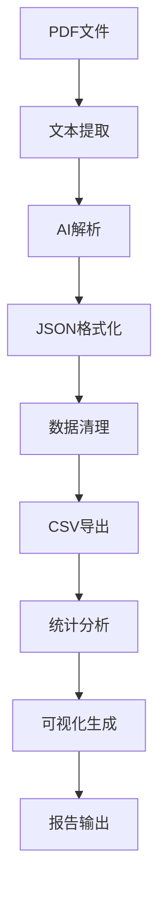

# NTU分布式系统考试指南 - 使用说明

## 🎯 项目概述

这是一个专为NTU分布式系统课程设计的智能考试分析工具，能够自动分析PDF格式的考试试卷，提取题目信息，并生成详细的统计分析报告。

## 🚀 快速开始

### 1. 环境准备

```bash
# 确保已安装 Python 3.8+
python3 --version

# 克隆或下载项目到本地
cd /path/to/DistributedSystem_riviewer
```

### 2. 配置API密钥

```bash
# 复制环境变量模板
cp .env.template .env

# 编辑.env文件，添加您的Google AI API密钥
GOOGLE_API_KEY=your_actual_api_key_here
```

**获取API密钥**: [Google AI Studio](https://aistudio.google.com/apikey)

⚠️ **重要更新**: 现在使用最新的Google AI API直接处理PDF文件，无需先提取文本，解析准确度更高！

### 3. 测试单个PDF（推荐先测试）

```bash
# 测试单个PDF文件
python test_single_pdf.py 1.pdf
```

这会帮您验证API配置和PDF解析功能是否正常工作。

### 4. 准备PDF文件

将考试试卷PDF文件放置在项目根目录下，支持的命名格式：
- `1.pdf`, `2.pdf`, `3.pdf`, ...
- 或任意有意义的PDF文件名

### 4. 安装依赖并运行

#### 方式一：使用启动脚本（推荐）
```bash
./run.sh
```

#### 方式二：手动执行
```bash
# 安装依赖
pip3 install -r requirements.txt

# 运行主程序
python3 main.py
```

## 📊 输出结果

程序执行完成后，会在 `output/` 目录下生成以下文件：

### 核心数据文件
- `questions.csv` - 核心题目数据（id, title, type, answer）
- `questions_full.csv` - 完整题目数据（包含知识点、来源等）
- `statistics.json` - 统计摘要信息

### 可视化图表
- `visualizations/question_type_distribution.png` - 题型分布图
- `visualizations/knowledge_points_analysis.png` - 知识点分析图
- `visualizations/interactive_dashboard.html` - 交互式仪表板 🌟

### 分析报告
- `visualizations/exam_insights_report.json` - 详细洞察报告
- `final_analysis_report.json` - 最终分析报告

## 🔍 功能特性

### 1. PDF智能解析
- 支持多种PDF格式
- 自动识别题目类型（选择题、填空题、简答题等）
- 提取标准答案（如果提供）
- 映射到课程知识点

### 2. 数据标准化
- 统一题型分类
- 文本清理和格式化
- 知识点自动标注
- CSV格式导出

### 3. 可视化分析
- 题型分布统计
- 知识点频率分析
- 交互式数据探索
- 考试趋势洞察

### 4. 智能推荐
- 重点复习建议
- 高频知识点提示
- 学习策略优化

## 📋 工作流程



1. **PDF文本提取**: 使用pdfplumber和PyPDF2双重提取
2. **AI智能解析**: Google Gemini Pro分析题目结构
3. **数据标准化**: 统一格式，清理文本
4. **统计分析**: 生成各类统计指标
5. **可视化展示**: 多种图表展示分析结果

## 🎛️ 高级配置

### 自定义题型映射
编辑 `src/data_processor.py` 中的 `type_mapping` 字典：

```python
type_mapping = {
    'your_type': '自定义题型',
    # ...
}
```

### 知识点关键词扩展
编辑 `src/data_processor.py` 中的 `keywords` 列表：

```python
keywords = [
    'Your Keyword',
    # ...
]
```

### 可视化主题定制
编辑 `src/visualizer.py` 中的颜色配置：

```python
self.colors = {
    'primary': '#your_color',
    # ...
}
```

## 🔧 故障排除

### 常见问题

**Q: API调用失败**
- 检查.env文件中的API密钥是否正确
- 确认网络连接正常
- 验证API额度是否用完

**Q: PDF解析失败**
- 确认PDF文件不是扫描版（需要OCR处理）
- 检查PDF文件是否损坏
- 尝试使用其他PDF文件测试

**Q: 可视化生成失败**
- 确保安装了所有依赖包
- 检查系统字体支持中文显示
- 确认有足够的磁盘空间

**Q: 内存不足**
- 减少并发处理的PDF数量
- 使用更小的PDF文件进行测试

### 日志调试
查看 `exam_analyzer.log` 文件获取详细的执行日志。

## 📈 结果解读

### 题型分布分析
- **选择题占比高**: 侧重基础概念理解
- **简答题较多**: 需要深入理解原理
- **编程题出现**: 关注实践应用能力

### 知识点热度
- **高频知识点**: 重点复习内容
- **覆盖率分析**: 了解考试范围
- **章节权重**: 分配学习时间

### 学习建议
根据 `exam_insights_report.json` 中的 recommendations 制定复习计划。

## 🤝 支持与反馈

如果您在使用过程中遇到问题或有改进建议，请：

1. 查看项目README.md
2. 检查常见问题解答
3. 提交Issue或联系项目团队

---

**祝您考试顺利！🎓**